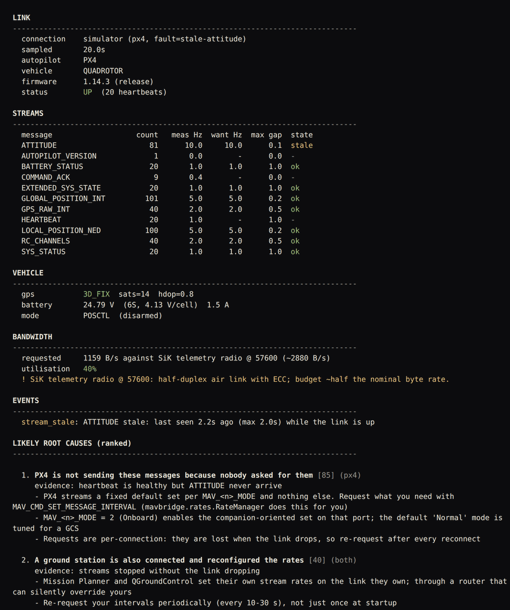
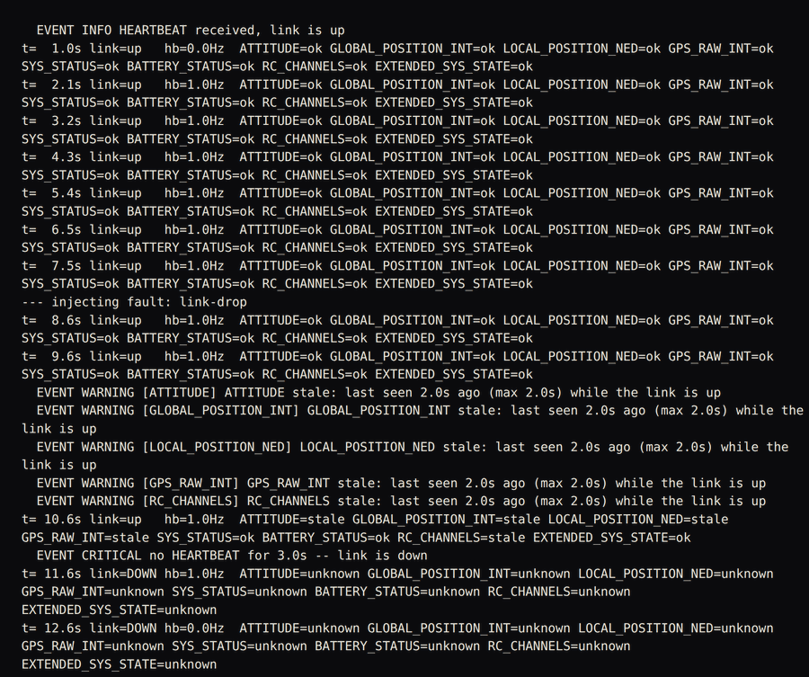
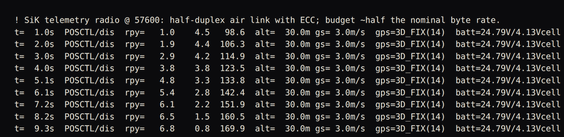

# px4-mavlink-companion

**MAVLink plumbing between a flight controller and a companion computer, with
the failure modes handled.**

Getting the first HEARTBEAT out of a Pixhawk takes ten lines. Keeping a link
alive on a vehicle for an hour, and knowing *which* part of it broke when the
data goes wrong, takes considerably more. This library is the second part.

The specific problem it solves: **telemetry that is present but wrong**. A
heartbeat check tells you the link is up. It does not tell you that
`GLOBAL_POSITION_INT` stopped ten seconds ago, or that `ATTITUDE` is still
arriving at a perfect 10 Hz with a timestamp that has not advanced since the
autopilot browned out. Both of those look healthy to a naive check, and both
will fly your vehicle into something.

`mavbridge` is a Python package (`src/mavbridge`) plus a CLI diagnostic
(`mavdiag`). It works with **PX4 and ArduPilot**, and every part of it that
does not touch hardware -- the watchdog, mode decoding, rate budgeting, the
dataclasses, the fault-injecting simulator -- runs and is unit-tested with
`pymavlink` **not installed**.

---

## Screenshots


`python3 tools/mavdiag.py --sim px4 --fault stale-attitude --duration 20 --radio sik57600`: a 20-second sample of the built-in PX4 simulator with a stale-ATTITUDE fault injected. Per-stream measured and requested rates, the bandwidth budget for a SiK 57600 radio, and the two most likely causes ranked with the evidence for each.


`python3 examples/link_health_monitor.py --sim --inject link-drop --seconds 13`: the watchdog on a simulated link that is cut at t=8s. Individual streams go stale before the heartbeat times out, so the per-stream warnings arrive about a second ahead of the link-down event.


`python3 examples/stream_telemetry.py --sim --seconds 10 --radio sik57600`: message intervals requested, then attitude, altitude, ground speed, GPS fix and battery decoded into one line per second, with an up-front warning that the requested rates are being checked against a half-duplex radio.

---

## Quickstart

```python
from mavbridge import MavLink, RateManager, TelemetryHub, Watchdog, default_streams
from mavbridge.rates import COMMON_COMPANION_RATES

link = MavLink("auto"); link.connect()   # or "serial:/dev/ttyACM0:921600", "udp:0.0.0.0:14540"
RateManager(link).request(list(COMMON_COMPANION_RATES))   # PX4 sends little unless asked
hub, watchdog = TelemetryHub(), Watchdog(default_streams())
while True:
    msg = link.recv(timeout=0.5)
    if msg: hub.handle(msg); watchdog.observe(msg)
    for event in watchdog.poll(): print(event)     # typed link-health events
```

No hardware handy? Everything below runs against the built-in simulator:

```bash
python3 tools/mavdiag.py --sim px4                      # a clean link
python3 tools/mavdiag.py --sim px4 --fault frozen       # frozen telemetry
python3 examples/link_health_monitor.py --sim --inject stale-attitude
python3 -m pytest -q
```

On real hardware:

```bash
pip install -r requirements.txt
python3 tools/mavdiag.py --port auto            # ranked diagnosis of whatever is wrong
python3 tools/mavdiag.py --port auto --json     # same, for CI or a health endpoint
```

---

## Architecture

```
      flight controller                       companion computer
   +---------------------+            +-------------------------------------+
   |   PX4 / ArduPilot   |            |             mavbridge               |
   |                     |            |                                     |
   |   HEARTBEAT         |            |  link.py                            |
   |   ATTITUDE          |<==========>|    by-id discovery, baud probing,   |
   |   GLOBAL_POSITION   |            |    reconnect w/ backoff + jitter    |
   |   GPS_RAW_INT       |  USB/UART  |               |                     |
   |   SYS_STATUS        |  UDP / TCP |               v                     |
   |   RC_CHANNELS       |            |        raw MAVLink messages         |
   +---------------------+            |        /              \             |
            ^   ^                     |       v                v            |
            |   |                     |  watchdog.py      telemetry.py      |
            |   |                     |  stale / frozen   SI dataclasses    |
            |   |                     |  backwards clock  PX4 + ArduPilot   |
            |   |                     |  link vs stream   modes, battery    |
            |   |                     |       |                |            |
            |   |                     |       v                v            |
            |   |                     |  LinkEvent stream subscribe(topic)  |
            |   |                     |  health snapshot  callbacks         |
            |   |                     |                                     |
            |   +---------------------+  rates.py     SET_MESSAGE_INTERVAL  |
            |                         |               (+ legacy fallback)   |
            +-------------------------+  offboard.py  setpoints + deadman   |
                                      |                                     |
                                      |  diagnose.py  ranked root causes    |
                                      |  simulator.py fault injection, no HW|
                                      +-------------------------------------+
```

| Module | What it does |
|---|---|
| `link.py` | Serial discovery preferring stable `by-id` names, connection strings (`serial:`/`udp:`/`tcp:`), baud probing confirmed by a real HEARTBEAT, reconnect with exponential backoff + jitter, clean shutdown |
| `watchdog.py` | Per-message freshness, and the four failure modes below told apart as typed events plus a JSON health snapshot |
| `telemetry.py` | Normalised dataclasses in SI units, flight-mode and arm-state decoding for PX4 *and* ArduPilot (copter/plane/rover), GPS fix quality, battery sag detection, RC failsafe |
| `rates.py` | `MAV_CMD_SET_MESSAGE_INTERVAL` with a legacy `REQUEST_DATA_STREAM` fallback, plus a bandwidth estimator that warns before you saturate a 57600 radio |
| `offboard.py` | Position/velocity setpoints in NED, the mandatory pre-stream before an OFFBOARD mode switch, arm/disarm with pre-arm result decoding, and a deadman that raises instead of letting the FC failsafe |
| `diagnose.py` | The CLI: identify, measure, and rank the likely root causes |
| `simulator.py` | A fake MAVLink source with on-demand fault injection, so all of the above is testable and demoable with no hardware and no SITL |

---

## What this handles that a tutorial script doesn't

**1. Stale telemetry, in four distinguishable flavours.** A dead link, a dead
stream, frozen contents, and a clock running backwards need four different
fixes, so they are four different events:

```
LINK_DOWN            no HEARTBEAT within the timeout -- and we deliberately do
                     not then spray fifteen per-stream alarms for one cause
STREAM_STALE         heartbeat fine, this message stopped
STREAM_MISSING       heartbeat fine, this message never arrived at all
                     (configuration, not link: PX4 intervals / ArduPilot SR*)
TIMESTAMP_FROZEN     packets at full rate, contents unchanged -- the classic
                     "the FC keeps handing you the last packet forever"
TIMESTAMP_BACKWARDS  two sources on one port, or a log replay overlapping live
AUTOPILOT_REBOOT     time_boot_ms reset to zero: a brownout, not a bad cable
```

**2. `/dev/ttyACM0` is not a stable name.** It is assigned in USB enumeration
order. Boot with a modem attached and your service opens the modem and waits
forever. Discovery prefers `/dev/serial/by-id/`, which is built from the USB
vendor, product and serial number, and ranks candidates deterministically so
the same board is chosen on every boot.

**3. A wrong baud does not raise an error.** It hands you garbage forever. The
only trustworthy confirmation is a framed, CRC-checked HEARTBEAT, so
`probe_baud()` tries candidates and waits for exactly that.

**4. PX4 will not enter OFFBOARD until setpoints are already streaming.**
It needs them at better than 2 Hz *before* the mode change, and it drops out
if they stop for about half a second. `OffboardController.engage()` streams
first, then requests the mode. This is the number one reason offboard control
"doesn't work", and you can reproduce both the failure and the fix offline:
`python3 examples/offboard_square.py --sim --skip-prestream`.

**5. A stalled control loop must not keep flying an old setpoint.** If your
loop stops refreshing the setpoint, the deadman stops the stream and raises
`DeadmanExpired`, rather than letting a background thread cheerfully re-send a
stale command until the failsafe notices.

**6. 57600 baud is 5760 bytes/s, not 7200.** 8N1 spends 10 bits per byte, and a
MAVLink 2 frame adds 12 bytes to every payload. Ask for ATTITUDE at 50 Hz on a
telemetry radio and you have spent the budget before adding anything else. The
estimator tells you at design time, with the message-by-message costs and
concrete rate cuts.

**7. PX4 and ArduPilot disagree about almost everything.** `custom_mode` is a
packed bitfield on PX4 and a flat table on ArduPilot -- a different table for
copter, plane and rover, so `custom_mode = 5` is LOITER on a copter and FBWA
on a plane. Rates are `SET_MESSAGE_INTERVAL` on one and `SR*` parameters on the
other. The diagnostic names the right parameter for the stack it detected.

**8. Raw MAVLink units are a trap.** Degrees are 1e7, altitudes are
millimetres, velocities are cm/s, headings are centidegrees with 65535 meaning
"unknown", and `current_battery = -1` means "no sensor" rather than -0.01 A.
Callers get dataclasses in SI units with `None` where the value is genuinely
unknown.

**9. It is testable without a drone.** The simulator injects link drops, stalled
streams, frozen timestamps, backwards clocks, reboots, GPS loss and battery sag
on demand. 169 deterministic tests run with `pymavlink` absent; nine more run
when it is installed and check every hardcoded wire constant -- message ids,
payload sizes, `MAV_RESULT`, position type masks -- against the generated
dialect, so the duplication that makes the offline tests possible cannot
silently drift. (It caught five wrong payload sizes and a wrong enum value
while this was being written, which is rather the point.)

---

## The diagnostic

```
$ python3 tools/mavdiag.py --sim ardupilot --fault frozen --duration 9

STREAMS
  message                   count   meas Hz  want Hz  max gap  state
  ATTITUDE                     90      10.0     10.0      0.1  frozen
  GLOBAL_POSITION_INT          45       5.0      5.0      0.2  frozen
  ...

LIKELY ROOT CAUSES (ranked)

  1. Packets keep arriving but their contents are stale [95] (both)
     evidence: timestamps not advancing on: ATTITUDE, GLOBAL_POSITION_INT
     - Something in the path is replaying a cached packet: a mavlink router
       with a stuck endpoint, a telemetry radio buffering, or a USB serial
       driver returning old data after an FC brownout
     - Power-cycle the FC and watch whether time_boot_ms restarts
     - If it only happens under load, you are saturating the link
```

It identifies the autopilot and firmware from `AUTOPILOT_VERSION`, measures the
real arrival rate and worst gap of every stream, checks GPS fix quality and
battery, estimates the bandwidth budget, and ranks causes with the exact
parameter names to check. `--json` gives the same content as an object.

Exit codes: `0` healthy, `1` problems found, `2` could not connect.

---

## Examples

| Script | What it shows | Needs |
|---|---|---|
| `examples/heartbeat_check.py` | Connect, confirm a HEARTBEAT, decode who is on the other end | FC, SITL, or `--sim` |
| `examples/stream_telemetry.py` | Request intervals, print normalised telemetry, check the radio budget first | FC, SITL, or `--sim` |
| `examples/offboard_square.py` | The correct offboard sequence, and the failure when you skip it | SITL strongly preferred, or `--sim` |
| `examples/link_health_monitor.py` | Production-shaped watchdog loop with injectable faults | FC, SITL, or `--sim` |

Each script's header states exactly what hardware or SITL setup it expects.

---

## Install

```bash
git clone https://github.com/Pratyush150/px4-mavlink-companion
cd px4-mavlink-companion
pip install -r requirements-dev.txt      # pymavlink, pyserial, pytest
python3 -m pytest -q
```

Requires Python 3.8+. `pymavlink` and `pyserial` are needed only to open a real
link; if they are missing, `mavbridge._mav` raises a single clear error that
tells you what to install (and reminds you about the `dialout` group) instead
of a `ModuleNotFoundError` from somewhere deep in a call stack.

---

## What this is, and what it isn't

**It is** the link layer: connection management, stream health, normalised
telemetry, rate control, and setpoint streaming with the safety interlocks that
matter. It is meant to sit under your application on a companion computer.

**It is not:**

- A flight stack, a controller, or an estimator. It does not stabilise
  anything. Control and estimation live in
  [drone-control-toolkit](https://github.com/Pratyush150/drone-control-toolkit).
- A mission planner. There is no mission upload/download, geofence or rally
  point support.
- A parameter manager. No `PARAM_SET`/`PARAM_REQUEST_LIST` handling.
- A router. If several processes need the same link, run `mavlink-router` or
  MAVProxy and point each consumer at its own endpoint.
- A log analyser. ULog/BIN post-flight analysis lives in
  [flight-log-analyzer](https://github.com/Pratyush150/flight-log-analyzer).
- A ROS 2 package. For a ROS 2 bringup around PX4, see
  [ros2-drone-bringup](https://github.com/Pratyush150/ros2-drone-bringup).

**Honest limitations:**

- MAVLink 2 signing is accounted for in the bandwidth estimator but is not
  implemented in the link layer.
- Only `SET_POSITION_TARGET_LOCAL_NED` setpoints are implemented. No global
  (`_GLOBAL_INT`) or attitude/thrust setpoints yet.
- Battery cell-count inference is a heuristic and is ambiguous at the edges
  (25.2 V is a full 6S or a mid-charge 7S). Pass the cell count explicitly if
  it matters.
- The bandwidth model uses maximum payload sizes; MAVLink 2 truncates trailing
  zero bytes, so real traffic is usually a little lighter than the estimate.
  The estimate is deliberately conservative.
- The "usable fraction" for a telemetry radio (about half its nominal byte
  rate) is a planning rule of thumb for budgeting, not a measurement of your
  specific radios. Measure yours with `mavdiag`.
- The simulator models message scheduling, timestamps, battery behaviour and
  command handling. It does not model flight dynamics, and it is not a
  replacement for SITL when you are testing control.
- Auto-discovery scans Linux device paths. Windows `COM*` ports parse in
  connection strings but are not discovered.
- Tested against PX4 and ArduPilot message semantics; the CI here runs
  offline against the simulator, not against a hardware-in-the-loop rig.

---

## Related

Part of a set of drone and robotics repositories:

- [drone-control-toolkit](https://github.com/Pratyush150/drone-control-toolkit) -- PID/LQR/complementary filter/EKF with a simulation harness
- [flight-log-analyzer](https://github.com/Pratyush150/flight-log-analyzer) -- ULog/BIN analysis: vibration, EKF, power, mode timeline
- [ros2-drone-bringup](https://github.com/Pratyush150/ros2-drone-bringup) -- ROS 2 bringup for a PX4 drone: TF, bridge, launch, SITL
- [jetson-realtime-detection](https://github.com/Pratyush150/jetson-realtime-detection) -- real-time detection and tracking on Jetson/edge

## License

MIT. See [LICENSE](LICENSE).
